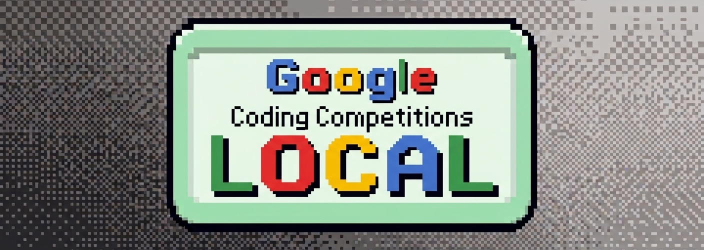

# Google Coding Competitions — Local



This is a fork of
[google/coding-competitions-archive](https://github.com/google/coding-competitions-archive),
the official archive of problems from Google's Coding Competitions (Code
Jam, Kick Start, Hash Code, and friends).

The upstream repo is just the raw archived data — problem statements,
analyses, sample data — with no way to browse or actually solve anything.
This fork adds [`emu/`](emu/), a small local web app on top of that data:
clone the repo, run it, and browse every problem organized by year and
round, with no account, server, or internet connection required.

Most competitions get a split-pane view — problem statement on the left,
code editor on the right. Hash Code is the exception: it never had an
online judge, just a PDF problem statement and an input dataset you'd
process yourself, so its page is a PDF reader plus an "Open dataset"
button per problem that reveals the input file in your OS's file explorer
(Finder/Explorer/whatever your Linux file manager is).

**This is a work in progress and not fully ready yet.** See
[Status](#status) below for what's currently browsable.

## Getting started

```bash
cd emu
npm install
npm run dev
```

Then open [http://localhost:3000](http://localhost:3000). The app reads
problem data straight out of the competition folders at the repo root — no
separate data setup needed.

## Status

Every competition in this archive is browsable now:

- **Kick Start** — all years, including practice rounds
- **Code Jam** — all years, including qualification/regional rounds and
  the 2008 regional semifinals
- **Code Jam to I/O for Women** — all years
- **Distributed Code Jam** — all years, including the 2015 online/practice
  rounds; a few 2018 Finals problems ship a commented reference solution
  instead of a written analysis, and are shown as such
- **Farewell Rounds** — the 2023 send-off event (Rounds A–D)
- **Hash Code** — all years, PDF statement + "open dataset" per problem
  instead of the usual code editor (see above)

Nothing left unwired, but plenty of rough edges remain — see the open
questions the app raised along the way, which are worth revisiting:

- A few Distributed Code Jam problems (2018 Finals) show a raw commented
  C++ solution as a stand-in for a missing written analysis.
- Distributed Code Jam's statement/analysis pages are unstyled HTML
  fragments (no CSS at all), unlike every other competition's polished
  pages.
- Problem/round titles for Distributed Code Jam and Hash Code are derived
  from filenames, not real metadata, so they're occasionally imperfect
  (e.g. an acronym rendered as "Rps" instead of "RPS").

## Project structure

```
.
├── codejam/              archived problem data, inherited from the
├── codejam_to_io/        upstream repo — one folder per competition,
├── distributed_codejam/  each split by year and round
├── farewell/
├── hashcode/
├── kickstart/
│
├── docs/                 contributing guide, code of conduct, this README's assets
│
└── emu/                  the local web app (Next.js) that browses the
                           folders above — see emu/README.md for app-level detail
```

Most problem folders (e.g. `kickstart/2022/round_a/<problem>/`) follow the
same shape: a `problem.yaml` with metadata, a `problem_statement/` with
the HTML statement and analysis, and sample/secret test data. Two
competitions differ: Distributed Code Jam skips `problem.yaml` entirely
(bare `statement.html`/`analysis.html`, titles derived from folder names),
and Hash Code has no per-problem folders at all — just one combined PDF
per round (`hashcode/<round>.pdf`) plus one flat input-dataset file per
problem (`hashcode/<round>/<dataset>`). `emu/` doesn't modify any of this
data — it only reads it.

## About the original archive

Problem data for the following contests is included, straight from
upstream:

- Distributed Code Jam
- Code Jam
- Code Jam to I/O for Women
- Farewell Rounds
- Hash Code
- Kick Start

The statement and analysis HTML files may have CSS or JS dependencies that
aren't included here. Some of the custom judging code may also have
library dependencies that aren't provided, so it may not run as-is — but
all problem-specific logic is there, which is enough to reproduce the
behavior (and is exactly what `emu/` does for rendering statements).

Some analysis for Distributed Code Jam problems couldn't be included, so a
commented solution was provided instead.

There's no plan (upstream or here) to add data for other contests, like
Code Jam for Europython or local/regional Code Jams.

## License

Apache License 2.0 — see [LICENSE](LICENSE).
